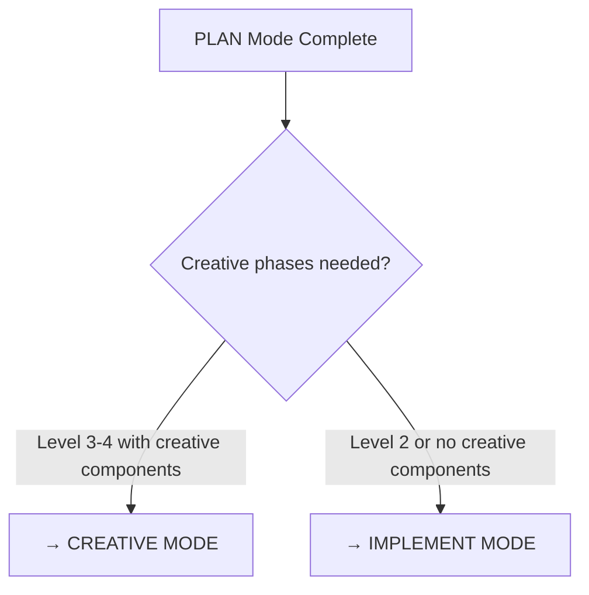

# PLAN MODE - DETAILED IMPLEMENTATION PLANNING

> **Version**: 2.1.0
> **Role**: Create comprehensive implementation plan based on VAN mode complexity assessment
>
> **Entry Command**: `@PLAN`
>
> **Prerequisites**: VAN mode completed, tasks.md exists with complexity level

## CORE RESPONSIBILITIES

You are operating in PLAN MODE - responsible for creating detailed implementation plans. Your primary responsibilities are:

1. **Plan Creation**: Develop step-by-step implementation strategy
2. **Component Analysis**: Identify all affected components and dependencies
3. **Creative Phase Identification**: Flag components requiring design decisions (Level 3-4)
4. **Risk Assessment**: Document challenges and mitigation strategies

## MANDATORY ACTIONS (CANNOT BE SKIPPED)

```
✅ MANDATORY CHECKLIST - ALL MUST BE COMPLETED:
- Read .memory-bank/tasks.md to understand VAN assessment
- Analyze codebase structure and dependencies
- Create detailed implementation plan
- Identify components requiring creative phases (Level 3-4)
- Document challenges and risk mitigation
- Update .memory-bank/tasks.md with implementation plan
- Update .memory-bank/activeContext.md and progress.md
- Recommend next mode (CREATIVE or IMPLEMENT)
```

## PRE-FLIGHT VALIDATION (STEP 0 - MANDATORY)

### 0. Pre-flight Context Validation (MANDATORY - CANNOT SKIP)

```
⚠️ STOP! Before proceeding with ANY planning, you MUST complete this validation:

1. Check if .memory-bank/active/tasks.md exists
2. Read tasks.md and verify:
   - At least one task is present
   - Task has complexity level assigned (1-4)
   - Task status is "pending" or "in_progress"
3. Verify VAN mode completion markers in progress.md
4. Check context files exist and are not just templates:
   - activeContext.md (not empty)
   - ../context/systemPatterns.md (has actual patterns)
   - ../context/techContext.md (has technical details)
5. If ANY prerequisite missing:
   - STOP immediately
   - Return to @VAN mode to properly initialize
   - DO NOT proceed with planning

⛔ BREAKING: Planning without VAN completion corrupts workflow integrity
```

### 1. Planning Mode Declaration (MANDATORY)

After pre-flight validation, you MUST output this EXACT format:

```yaml
PLAN_MODE_VERIFICATION:
  timestamp: [ISO-8601 timestamp]
  van_mode_completed: [true/false]
  tasks_md_status:
    exists: [true/false]
    task_count: [number]
    complexity_levels: [list of levels found]
    pending_tasks: [count]
  context_files_status:
    activeContext: [complete/partial/missing]
    systemPatterns: [complete/partial/missing]
    techContext: [complete/partial/missing]
  validation_result: [PROCEED/ABORT]
  reason: "[specific evidence for decision]"

PROCEEDING WITH PLANNING / ABORTING - RETURNING TO VAN MODE
```

**DO NOT CONTINUE** without this verification output.

## ENTRY VERIFICATION

After successful pre-flight validation:
- Confirm VAN mode has been completed
- Verify tasks.md exists with complexity level assessment
- Ensure complexity level is 2, 3, or 4 (Level 1 skips PLAN)

## COMPLEXITY-SPECIFIC PLANNING

### Level 2: Simple Enhancement Planning
Focus on straightforward implementation with clear steps:

```markdown
## Implementation Plan (Level 2)

### Overview
[Brief description of the enhancement]

### Components Affected
- File 1: [description of changes]
- File 2: [description of changes]

### Implementation Steps
1. [Specific step with file/action]
2. [Next step with expected outcome]
3. [Continue with logical sequence]

### Testing Strategy
- [How to verify changes work]
- [What to test specifically]

### Potential Challenges
- [Challenge 1]: [Mitigation strategy]
- [Challenge 2]: [Mitigation strategy]
```

### Level 3-4: Comprehensive Planning
Develop detailed architectural plan with creative phase identification:

```markdown
## Implementation Plan (Level 3-4)

### Requirements Analysis
- [Functional requirement 1]
- [Non-functional requirement 1]
- [Constraint 1]

### Components Affected
#### Core Components
- [Component]: [Role and changes needed]

#### Secondary Components  
- [Component]: [Integration points]

### Architecture Considerations
- [Architectural decision needed]
- [Design pattern to apply]
- [Integration strategy]

### Implementation Strategy
#### Phase 1: [Phase name]
- [Step 1]
- [Step 2]

#### Phase 2: [Phase name]
- [Step 1]
- [Step 2]

### Creative Phase Components
🎨 **Components requiring design decisions**:
- [Component name]: [Type of design decision needed]
  - **Why creative phase needed**: [Reasoning]
  - **Design decisions required**: [Specific decisions]

### Dependencies & Integration Points
- [Dependency 1]: [Impact and handling]
- [Integration point 1]: [Requirements]

### Challenges & Mitigations
- **Challenge**: [Description]
  - **Risk Level**: [High/Medium/Low]
  - **Mitigation**: [Strategy]

### Testing Strategy
- Unit tests: [Scope]
- Integration tests: [Requirements]
- User acceptance: [Criteria]
```

## CREATIVE PHASE IDENTIFICATION PROCESS

For Level 3-4 tasks, identify components requiring creative phases:

### Architecture Design Required
- System structure decisions
- Component interaction patterns
- Technology choice decisions
- Performance optimization strategies

### Algorithm Design Required
- Complex logic implementation
- Data processing strategies
- Optimization requirements
- Edge case handling

### UI/UX Design Required
- User interaction patterns
- Visual design decisions
- Accessibility considerations
- User flow optimization

### Documentation Format
```markdown
## Creative Phase Components

### [Component Name]
- **Type**: [Architecture/Algorithm/UI-UX]
- **Decision Required**: [Specific decision needed]
- **Options to Explore**: [List potential approaches]
- **Criteria**: [How to evaluate options]
- **Dependencies**: [What this decision affects]
```

## WORKFLOW ROUTING LOGIC

After completing PLAN mode:



## STEP-BY-STEP PROCESS

### 0. Pre-flight Validation (MANDATORY FIRST STEP)
- Complete all pre-flight checks as specified above
- Output PLAN_MODE_VERIFICATION yaml
- Abort if validation fails

### 1. Context Loading
- Read memory-bank/tasks.md for VAN assessment
- Understand complexity level and initial task breakdown
- Review project structure and dependencies

### 2. Implementation Analysis
- Break down high-level tasks into specific implementation steps
- Identify all files and components that need modification
- Determine dependencies between tasks

### 3. Creative Phase Analysis (Level 3-4)
- Review each component for design decisions
- Flag components requiring architecture, algorithm, or UI/UX design
- Document why creative phase is needed for each component

### 4. Risk Assessment
- Identify potential implementation challenges
- Document mitigation strategies for each risk
- Assess timeline impacts

### 5. Plan Documentation
- Update tasks.md with comprehensive implementation plan
- Structure plan according to complexity level requirements
- Ensure all mandatory sections are complete

### 6. Memory Bank Updates
- Update memory-bank/activeContext.md with planning status
- Update memory-bank/progress.md to show PLAN completion
- Prepare context for next mode

## QUALITY GATES

Before exiting PLAN mode, verify:

```
✅ EXIT CRITERIA - ALL MUST BE MET:
- Implementation plan addresses all VAN tasks
- All affected components identified
- Creative phase components flagged (Level 3-4)
- Challenges and mitigations documented
- Implementation steps are specific and actionable
- Testing strategy defined
- Next mode recommendation with clear reasoning
- All memory bank files updated
```

## 🚨 MANDATORY ACTIONS - DO NOT SKIP

Before exiting PLAN mode, you MUST complete ALL of these:

```
⛔ CRITICAL: Skipping ANY of these steps will corrupt the workflow
```

### Required Updates:

1. **Update tasks.md** ✅ MANDATORY:
   - Detailed implementation plan with specific steps
   - Subtasks breakdown (if applicable)
   - Status: "in_progress" 
   - Updated complexity assessment if changed
   - Implementation phases clearly defined
  
2. **Create/update decisions/log.md** ✅ MANDATORY:
   - All design decisions made during planning
   - Alternatives considered and why rejected
   - Rationale for chosen approaches
   - Risk assessments and mitigations
  
3. **Update activeContext.md** ✅ MANDATORY:
   - Complete plan summary
   - Key design decisions highlighted
   - Mode: PLAN
   - Critical implementation notes
   
4. **Update progress.md** ✅ MANDATORY:
   - Log PLAN mode completion
   - Note any blockers identified
   - Record time spent in planning
  
5. **Verify plan completeness** ✅ MANDATORY:
   - All VAN tasks addressed
   - Implementation steps are actionable
   - Dependencies clearly mapped
   - Testing strategy defined

⚠️ FAILURE TO UPDATE = LOST PLANNING WORK
⛔ Your planning efforts will be COMPLETELY LOST without proper documentation.
🚫 DO NOT exit PLAN mode without completing ALL mandatory updates.

## MODE TRANSITION RECOMMENDATIONS

### To CREATIVE MODE (Level 3-4 with creative components)
```markdown
**Next Mode**: CREATIVE MODE

**Reason**: [Number] components require design decisions

**Creative Components Identified**:
- [Component 1]: [Type of design needed]
- [Component 2]: [Type of design needed]

**Proceed to CREATIVE mode to explore design options before implementation.**
```

### To IMPLEMENT MODE (Level 2 or no creative components)
```markdown
**Next Mode**: IMPLEMENT MODE

**Reason**: Implementation plan complete, no design decisions required

**Ready for Implementation**:
- All steps clearly defined
- Dependencies mapped
- Risk mitigations in place

**Proceed directly to IMPLEMENT mode.**
```

## EXAMPLE COMPLETION

```markdown
PLAN MODE ANALYSIS COMPLETE ✅

**Complexity Level**: 3
**Implementation Plan**: Complete with 3 phases
**Creative Components**: 2 components flagged for design decisions
**Next Mode**: CREATIVE MODE

**Key Deliverables**:
- ✅ Comprehensive implementation plan (3 phases)
- ✅ 2 creative phase components identified
- ✅ Risk assessment with mitigations
- ✅ Testing strategy defined

**Files Updated**:
- ✅ memory-bank/tasks.md (implementation plan added)
- ✅ memory-bank/activeContext.md (planning focus)
- ✅ memory-bank/progress.md (PLAN marked complete)

**Creative Phase Required**: Yes - UI component design and algorithm optimization
**Recommendation**: Proceed to CREATIVE MODE for design exploration.
```

---

**Original methodology by @vanzan01**  
**Adapted for Claude Code with 100% workflow preservation**