# Claude Code Memory Bank Configuration - Hybrid System

> **Memory Bank System v2.0** - Context-Driven Workflow  
> Original methodology by @vanzan01, hybrid design for optimal context + workflow balance  
> Combines context preservation with structured development workflow

## System Overview

The Memory Bank hybrid system combines context-driven development with structured workflow modes. It prioritizes understanding through persistent context files while maintaining quality through simplified workflow progression.

### Core Philosophy

1. **Context First**: All work begins with understanding the system through context files
2. **Adaptive Workflow**: Workflow complexity scales with task complexity (3 levels)
3. **Living Documentation**: Context files are continuously updated as the system evolves
4. **Minimal Ceremony**: Only use workflow modes that add value to the current task

### System Architecture

```mermaid
flowchart TD
    subgraph "Context Foundation"
        PB[📄 projectBrief.md] --> PC[🎯 productContext.md]
        PB --> SP[🏗️ systemPatterns.md]
        PB --> TC[⚙️ techContext.md]
    end
    
    subgraph "Workflow Modes"
        VAN[🔍 VAN: Initialize]
        PLAN[📋 PLAN: Strategy]
        IMPLEMENT[⚒️ IMPLEMENT: Build]
        REFLECT[✅ REFLECT: Validate]
    end
    
    subgraph "Active Work"
        PC --> AC[💡 activeContext.md]
        SP --> AC
        TC --> AC
        AC --> TM[📝 tasks.md]
        TM --> PR[📊 progress.md]
    end
```



## Project Structure Detection

### Single Project Repository
```
.memory-bank/
├── context/                    # Project understanding
├── active/                     # Current work tracking
├── technical/                  # Deep technical docs
├── decisions/                  # Design decisions
└── qa/                        # Quality assurance
```

**Reading Strategy**: Read ALL folders to understand the complete project

### Multi-Project Repository
```
.memory-bank/
├── shared/                     # Cross-project resources
│   ├── patterns.md            # Common code patterns
│   └── conventions.md         # Shared conventions
├── project-a/                  # Each project has full structure
│   ├── context/
│   ├── active/
│   ├── technical/
│   ├── decisions/
│   └── qa/
└── project-b/
    ├── context/
    ├── active/
    └── ...
```

**Reading Strategy**: 
1. **First**: Read `shared/` for global conventions
2. **Then**: Scan ALL projects' `active/` folders for ongoing tasks
3. **Finally**: Focus on specific project based on task or user choice

## Reading Instructions

### On Startup (Multi-Project)

1. **Check Structure**: Determine if single or multi-project
2. **If Multi-Project**:
   - Read `shared/` folder for global patterns and conventions
   - Scan each project's `active/tasks.md` and `decisions/log.md`
   - Identify projects with active tasks
   - Present options to user:
     ```
     Active tasks found in:
     - project-a: "Implement user authentication" (Level 2, in PLAN mode)
     - project-b: "Fix caching bug" (Level 1, in IMPLEMENT mode)
     
     Would you like to continue one of these tasks or start something new?
     ```

### Reading Order by Structure

#### Single Project
1. **context/** - Complete project understanding
2. **active/** - Current work state
3. **technical/** - Implementation details
4. **decisions/** - Historical choices

#### Multi-Project
1. **shared/** - Global conventions and patterns
2. ***/active/** - Scan all projects for active work
3. **[selected-project]/context/** - Project-specific understanding
4. **[selected-project]/technical/** - Project-specific details
5. **[selected-project]/decisions/** - Project-specific history

## File Structure Details

### Core Directories

#### context/
- **projectBrief.md** - Project overview and goals
- **productContext.md** - Business and user perspective  
- **systemPatterns.md** - Architecture and code patterns
- **techContext.md** - Technical implementation details

#### active/
- **activeContext.md** - Synthesized working context
- **tasks.md** - Active task list and plans
- **progress.md** - Progress tracking

#### technical/
- Deep implementation documentation
- Architecture diagrams
- API specifications
- Performance details

#### decisions/
- **log.md** - Chronological decision record

#### qa/
- **validation-results.md** - Test results and learnings

### Multi-Project Additions

#### shared/
- **patterns.md** - Cross-project code patterns
- **conventions.md** - Global coding standards
- **architecture.md** - Overall system design

## Workflow Modes (4 Simplified Modes)

### @VAN - Initialize & Assess
**Purpose**: Establish context foundation and assess task complexity  
**Always First**: Every workflow begins with VAN to ensure context

When `@VAN` is invoked:
1. Detect project structure (single vs multi)
2. Read appropriate context based on structure
3. Check for active tasks across projects
4. Create/update context files as needed
5. Determine complexity level (1-3)
6. Route to next appropriate mode

**Context Detection**:
- Single project: Read all context files
- Multi-project: Read shared + scan for active tasks + selected project context

### @PLAN - Strategy & Design
**Purpose**: Create context-informed implementation strategy  
**Prerequisites**: VAN completed, Level 2+ complexity

When `@PLAN` is invoked:
1. Read context files (project-specific in multi-repo)
2. Create detailed implementation plan
3. For Level 3: Conduct design exploration
4. Document decisions in project's decisions/log.md
5. Update project's activeContext.md

### @IMPLEMENT - Build & Test
**Purpose**: Execute plan following established patterns  
**Prerequisites**: VAN completed; PLAN completed for Level 2+

When `@IMPLEMENT` is invoked:
1. Read project's activeContext.md and tasks.md
2. Follow patterns from shared/ and project's systemPatterns.md
3. Build incrementally with continuous testing
4. Update project's progress.md continuously

### @REFLECT - Validate & Learn  
**Purpose**: Ensure quality and capture learnings  
**Prerequisites**: IMPLEMENT completed

When `@REFLECT` is invoked:
1. Validate implementation against requirements
2. Update project's context files with learnings
3. Update shared/patterns.md if pattern is reusable
4. Create validation report in project's qa/

## Complexity Levels (Simplified to 3)

### Level 1: Quick Fix
- **Criteria**: Single file, clear fix, minimal testing needed
- **Duration**: < 1 hour
- **Workflow**: VAN → IMPLEMENT → REFLECT

### Level 2: Feature/Enhancement  
- **Criteria**: Multiple files, clear requirements, some design choices
- **Duration**: 1 hour - 1 day
- **Workflow**: VAN → PLAN → IMPLEMENT → REFLECT

### Level 3: Complex Feature
- **Criteria**: Multiple components, design decisions, architectural impact
- **Duration**: 1+ days
- **Workflow**: VAN → PLAN (with design) → IMPLEMENT → REFLECT

## Project-Specific Workflow

### Starting Work in Multi-Project Repo

```
User: "I need to work on the API feature"

Claude (after reading structure):
I've detected this is a multi-project repository with:
- api-service (has active Level 2 task in IMPLEMENT mode)
- web-app (no active tasks)
- mobile-app (has active Level 3 task in PLAN mode)

Would you like to:
1. Continue the API service task: "Add rate limiting"
2. Continue the mobile app task: "Implement offline mode"
3. Start a new task for the API service
```

### Context Isolation

In multi-project repos, each project maintains isolated:
- Context files (not shared between projects)
- Active work tracking
- Technical documentation
- Decision logs

Only `shared/` contains cross-project resources.

## Key Principles

### Context Persistence
- Context files are created once and updated continuously
- In multi-project: Each project has its own context
- Shared patterns benefit all projects

### Workflow Flexibility  
- Skip modes when context makes path obvious
- Multi-project: Work on multiple projects in parallel
- Switch between projects cleanly

### Quality Through Understanding
- Quality comes from understanding system context
- Multi-project: Understand both shared conventions and project specifics
- Patterns ensure consistency across projects

## Mode Transitions


## Error Recovery

### Missing Context
If context files are missing or incomplete:
1. Return to @VAN mode immediately
2. Rebuild context from project analysis
3. In multi-project: Ensure correct project selected

### Active Task Conflicts
If multiple active tasks in same project:
1. Present all active tasks to user
2. Let user choose which to continue
3. Or allow starting fresh task

### Stale Context
If context seems outdated:
1. Run @VAN with focus on updates
2. Review and refresh all context files
3. Update activeContext.md synthesis

## Benefits of Hybrid Approach

1. **Best of Both Worlds**: Context preservation + workflow structure
2. **Reduced Complexity**: 4 modes instead of 6 in the Cursor approach
3. **Flexible Application**: Adapt to task needs
4. **Living Documentation**: Context stays current
5. **Multi-Project Support**: Scales from single to many projects
6. **Smart Task Management**: Detects and suggests active work
7. **Quality Assurance**: Built-in validation steps

---

**Original Methodology**: @vanzan01 (cursor-memory-bank)  
**Hybrid Design**: Optimized for context-driven development with workflow benefits  
**Version**: 2.0 - Context-Driven Workflow System