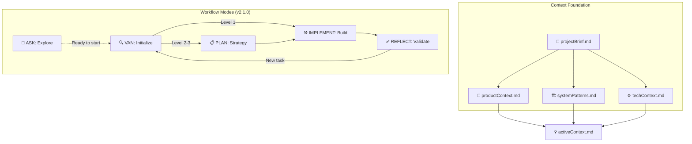
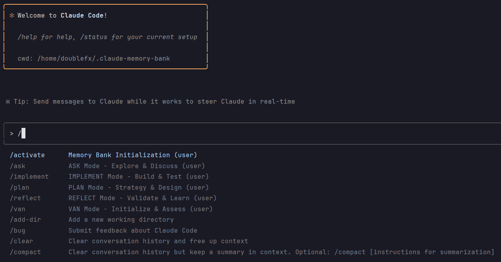

# Claude Memory Bank

> **Memory Bank System v2.3.0 - Enhanced Context-Driven Workflow**  
> Based on original methodology by [@vanzan01](https://github.com/vanzan01/cursor-memory-bank)  
> Supports both single-project and multi-project repositories  
> Combines context preservation with streamlined workflow (5 modes)

## 🚨 Breaking Changes

### v2.3.0
- **CLAUDE.md Removed**: Bootstrap configuration moved to `.memory-bank/BOOTSTRAP.md`
- **No User Impact**: File is internal and only accessed via slash commands
- **Avoids Conflicts**: No longer conflicts with user's CLAUDE.md files

### v2.2.0

**Slash commands have moved to user level!** 
- Old: `/project:ask`, `/project:van`, etc.
- New: `/user:memory-bank:ask`, `/user:memory-bank:van`, etc.

To migrate:
1. Run the installer: `curl -sSL https://raw.githubusercontent.com/doublefx/claude-memory-bank/main/install.sh | bash`
2. Old project commands will be automatically cleaned up
3. Update any scripts/aliases using the old command format

A context-driven development system for Claude Code that automatically adapts to your repository structure. Whether you're working on a single project or managing multiple projects in a monorepo, the Memory Bank system provides persistent context and structured workflows.



## 🎯 Core Objectives

The Memory Bank v2.0 system evolves to support flexible project structures while maintaining workflow quality:

- **5-Mode Workflow**: ASK (optional) → VAN → PLAN → IMPLEMENT → REFLECT progression
- **Auto-Detection**: Automatically identifies single vs multi-project repositories
- **Context First**: All work begins with understanding through context files
- **Project Isolation**: Each project maintains independent context in multi-project
- **Shared Patterns**: Cross-project learnings in multi-project repos
- **Adaptive Routing**: 3 complexity levels determine required modes
- **Living Documentation**: Context files evolve with each task
- **Active Task Awareness**: Scans and presents ongoing work across projects

## 🔄 Evolution: From Original to Hybrid

### Original System (6 Modes)
The original cursor-memory-bank used a comprehensive 6-mode workflow:
- **VAN** → **PLAN** → **CREATIVE** → **IMPLEMENT** → **REFLECT** → **ARCHIVE**
- Task-focused with `tasks.md` as central truth
- Separate CREATIVE mode for all design work
- Mandatory ARCHIVE mode for Level 3-4 tasks
- 4 complexity levels with rigid routing

### Memory Bank v2.1.0 (5 Modes) - Why It's Better

#### 1. **Optimized Complexity**
- **From 6 to 5 modes**: Eliminated redundant steps, added exploration
- **CREATIVE merged into PLAN**: Design exploration happens where planning occurs
- **ARCHIVE eliminated**: Context files serve as living documentation
- **ASK mode added**: Conversational exploration before commitment
- **Result**: Better entry point with exploration, while maintaining efficiency

#### 2. **Context-Driven Development**
- **4 Foundation Files**: `projectBrief.md`, `productContext.md`, `systemPatterns.md`, `techContext.md`
- **Persistent Understanding**: Context survives across tasks and sessions
- **Pattern Evolution**: Discoveries immediately enrich future work
- **Result**: Every decision is informed by accumulated knowledge

#### 3. **Flexible Workflow**
- **3 complexity levels** (vs 4): Simpler assessment
- **Optional modes**: Skip PLAN for Level 1 quick fixes
- **Integrated design**: No separate creative phase overhead
- **Result**: Right-sized process for each task

#### 4. **Living Documentation**
- **No duplicate archiving**: Knowledge goes directly to context files
- **Immediate availability**: Insights ready for next task
- **Continuous evolution**: Documentation grows organically
- **Result**: Always up-to-date, never stale

#### 5. **Better Developer Experience**
- **Faster onboarding**: Read context files to understand everything
- **Less ceremony**: Focus on building, not process
- **Natural flow**: Context → Plan → Build → Learn
- **Result**: More time coding, less time documenting

#### 6. **Multi-Project Support (v2.0)**
- **Auto-detection**: Recognizes repository structure
- **Task continuity**: Resume work across sessions
- **Shared patterns**: Cross-project learning
- **Project isolation**: Independent context per project
- **Result**: Scales from simple to complex repositories

## 🚀 Quick Start

### One-Line Installation
```bash
curl -sSL https://raw.githubusercontent.com/doublefx/claude-memory-bank/main/install.sh | bash
```

### Project Setup

#### Single-Project Repository
```bash
# Navigate to your project
cd your-project

# Initialize Memory Bank (interactive)
setup-memory-bank.sh
# OR force single-project
setup-memory-bank.sh --single

# After setup, you can use the local copy:
./setup-memory-bank.sh --help
```

#### Multi-Project Repository
```bash
# Navigate to repository root
cd your-monorepo

# Initialize multi-project Memory Bank
setup-memory-bank.sh --multi

# Add projects later (using local copy)
./setup-memory-bank.sh --add-project
# Or with project name
./setup-memory-bank.sh --add-project project-name
```

### Start Working

#### Using Slash Commands (Recommended)



```bash
# Initialize Memory Bank system
/user:memory-bank:activate

# Explore and ask questions
/user:memory-bank:ask

# Start a new task
/user:memory-bank:van
```

#### Using @ Commands (Direct)
```bash
# Start with exploration
@ASK

# Or jump to task initialization
@VAN
```

## 📋 System Requirements

- **Claude Code**: Latest version recommended
- **Python 3.7+**: For automation scripts
- **Git**: For decision extraction and version control
- **Bash/Shell**: For installation and setup scripts

## 📁 Installation Structure

After installation, the file structure is:
```
~/.claude-memory-bank/
├── claude-memory-bank/         # Git repository with templates
│   ├── setup-memory-bank.sh    # The actual setup script
│   ├── .memory-bank/           # Template files
│   └── ...                     # Other template files
└── (no files at root level)    # Commands are in ~/.local/bin/
```

The `cmb-setup` command points to the script inside `claude-memory-bank/`.

## 🏗️ Architecture Overview

### Mode System
```
┌─────────────────────────────────────────────────────────┐
│                   MODE ROUTING (HYBRID)                 │
├─────────────────────────────────────────────────────────┤
│ Level 1: VAN → IMPLEMENT → REFLECT                    │
│ Level 2: VAN → PLAN → IMPLEMENT → REFLECT             │
│ Level 3: VAN → PLAN (with design) → IMPLEMENT → REFLECT│
└─────────────────────────────────────────────────────────┘
```

### File System

#### Single-Project Structure
```
project/
├── starter-prompt.md            # Initialization guide
├── .claude/                     # Claude Code Terminal integration
│   └── commands/                # Slash commands (v2.1.0)
│       ├── memory-bank.md
│       ├── van.md
│       ├── plan.md
│       ├── implement.md
│       ├── reflect.md
│       └── ask.md
├── .memory-bank/
│   ├── BOOTSTRAP.md             # Internal bootstrap configuration
│   ├── custom_modes/            # Mode instruction files
│   │   ├── van_instructions.md
│   │   ├── plan_instructions.md
│   │   ├── implement_instructions.md
│   │   ├── reflect_instructions.md
│   │   └── ask_instructions.md  # v2.1.0
│   ├── context/                 # Foundation files
│   │   ├── projectBrief.md
│   │   ├── productContext.md
│   │   ├── systemPatterns.md
│   │   └── techContext.md
│   ├── active/                  # Current work
│   │   ├── tasks.md
│   │   ├── activeContext.md
│   │   ├── progress.md
│   │   └── temp-files.md        # v2.1.0
│   ├── technical/               # Deep implementation docs
│   ├── decisions/               # Design decisions
│   │   └── log.md
│   ├── qa/                      # Quality assurance
│   │   └── validation-results.md
│   └── scripts/                 # Automation tools
│       └── auto-update.py
```

#### Multi-Project Structure
```
monorepo/
├── starter-prompt.md            # Initialization guide
├── .memory-bank/
│   ├── BOOTSTRAP.md             # Internal bootstrap configuration
│   ├── custom_modes/            # Mode instruction files
│   ├── shared/                  # Cross-project resources
│   │   ├── patterns.md          # Reusable patterns
│   │   └── conventions.md       # Global standards
│   ├── api-service/             # Project 1
│   │   ├── context/             # Project-specific context
│   │   ├── active/              # Current work
│   │   ├── technical/           # Implementation docs
│   │   ├── decisions/           # Project decisions
│   │   └── qa/                  # Project QA
│   ├── web-app/                 # Project 2
│   │   └── [same structure]
│   └── scripts/                 # Automation tools
```

## 🔧 Mode Detailed Documentation

### 💬 ASK Mode - Explore & Discuss
**Purpose**: Conversational exploration without implementation  
**Entry**: `/user:memory-bank:ask` or `@ASK` (Optional starting point)  
**Output**: Understanding and guidance, routes to appropriate mode

```markdown
Responsibilities:
- Answer questions about code, architecture, or workflow
- Explore potential approaches without implementing
- Educate users on Memory Bank workflow
- READ-ONLY mode - no file modifications
- Suggest appropriate workflow mode when ready

Perfect for:
- New users learning the system
- Exploring "what if" scenarios
- Understanding existing code
- Planning before committing to changes
```

### 🔍 VAN Mode - Initialization & Assessment
**Purpose**: Structure detection, project analysis and complexity assessment  
**Entry**: `/user:memory-bank:van` or `@VAN` (Required for actual work)  
**Output**: Context files, tasks.md with complexity level and routing

```markdown
Responsibilities:
- Detect single vs multi-project repository structure
- For multi-project: Scan all projects for active tasks
- Analyze project structure and requirements
- Create/update 4 context foundation files
- Assess complexity level (1-3) using defined criteria
- Route to appropriate next mode

Multi-Project Features:
- Lists all projects with active tasks
- Presents task continuation options
- Isolates context per project
- Reads shared patterns first
```

**Complexity Levels**:
- **Level 1**: Quick bug fix (< 1 hour) → IMPLEMENT
- **Level 2**: Feature/Enhancement (1 hour - 1 day) → PLAN
- **Level 3**: Complex feature (1+ days) → PLAN (with design)

### 📋 PLAN Mode - Strategy & Design
**Purpose**: Context-informed implementation strategy  
**Entry**: `/user:memory-bank:plan` or `@PLAN` (after VAN for Level 2-3)  
**Output**: Implementation plan with integrated design exploration

```markdown
Responsibilities:
- Create strategy using context files
- For Level 3: Include design exploration
- Document decisions in design-log.md
- Identify risks and mitigation strategies
```

### ⚙️ Context Files (Created by VAN)
**Purpose**: Foundation for all development work  
**Files**: 4 persistent context files

```markdown
Context Foundation:
- projectBrief.md: Overview and goals
- productContext.md: User needs and features
- systemPatterns.md: Architecture and conventions
- techContext.md: Technical implementation details
```

**Living Documentation**: Context files evolve with each task

### ⚒️ IMPLEMENT Mode - Build & Test
**Purpose**: Execute implementation following context and plan  
**Entry**: `/user:memory-bank:implement` or `@IMPLEMENT` (after VAN for Level 1, after PLAN for Level 2-3)  
**Output**: Working implementation with comprehensive testing

```markdown
Implementation Approach:
- Level 1: Focused bug fixing with immediate testing
- Level 2: Sequential component implementation  
- Level 3: Phased implementation applying design decisions
```

### 🔍 REFLECT Mode - Validate & Learn
**Purpose**: Quality validation and context updates  
**Entry**: `/user:memory-bank:reflect` or `@REFLECT` (after IMPLEMENT)  
**Output**: Validation results and updated context files

```markdown
Validation & Learning:
- Requirements verification
- Test execution and validation
- Update context files with discoveries
- Document patterns and anti-patterns
- Context files serve as living documentation
```

## 🎛️ Advanced Features

### 🤖 Automation Scripts

#### Single-Project Commands
```bash
# Check context health
python .memory-bank/scripts/auto-update.py --health-check

# Auto-detect code patterns
python .memory-bank/scripts/auto-update.py --scan-patterns

# Extract decisions from git history  
python .memory-bank/scripts/auto-update.py --extract-decisions

# List available tasks
python .memory-bank/scripts/auto-update.py --list-tasks

# Run all automation
python .memory-bank/scripts/auto-update.py --all
```

#### Hierarchical Project Analysis
```bash
# Detect nested repositories
python .memory-bank/scripts/detect-hierarchy.py

# Save hierarchy map
python .memory-bank/scripts/detect-hierarchy.py --save

# Output JSON structure
python .memory-bank/scripts/detect-hierarchy.py --json
```

#### Automated Hierarchical Setup
```bash
# After initial setup in root, auto-setup all nested repos
python .memory-bank/scripts/auto-setup-hierarchy.py

# Or use the bash version if available
bash .memory-bank/scripts/setup-hierarchy.sh
```

#### Multi-Project Commands
```bash
# List all projects
python .memory-bank/scripts/auto-update.py --list-projects

# Project-specific operations
python .memory-bank/scripts/auto-update.py --health-check --project-name api-service
python .memory-bank/scripts/auto-update.py --scan-patterns --project-name web-app

# Run all for specific project
python .memory-bank/scripts/auto-update.py --all --project-name mobile-app
```

### 🔄 Cross-Project Learning
- Pattern detection and extraction
- Decision history analysis
- Best practices sharing
- Template evolution

### 📊 Progress Tracking
- Real-time workflow status
- Complexity assessment accuracy
- Time estimation improvements
- Quality metrics evolution

## 🛠️ Usage Examples

### Example 1: Simple Bug Fix (Level 1)
```
User: Fix the login validation error

@VAN
> Analyzes: Level 1 - Simple bug fix, single function change
> Creates: tasks.md with targeted fix plan
> Routes: Direct to IMPLEMENT

@IMPLEMENT  
> Fixes: Authentication validation logic
> Tests: Login scenarios
> Documents: Change details
> Routes: To REFLECT (optional for Level 1)
```

### Example 2: Multi-Project Task Selection
```
User: I need to work on the API improvements

@VAN
> Detects: Multi-project repository structure
> Scans: All projects for active tasks
> Finds: Active tasks in api-service and auth-service
> Presents: Task selection options

"Active tasks found:
1. api-service: 'Add rate limiting' (Level 2, in IMPLEMENT)
2. auth-service: 'Implement OAuth2' (Level 3, in PLAN)
3. Start new API task"

User: Continue with rate limiting

> Loads: api-service context and active work
> Routes: To IMPLEMENT mode to continue
```

### Example 3: Complex Feature (Level 3)
```
User: Add user dashboard with analytics

@VAN
> Analyzes: Level 3 - Complex feature, multiple components
> Creates/Updates: All 4 context files
> Synthesizes: activeContext.md
> Routes: To PLAN mode

@PLAN
> Plans: Multi-phase implementation strategy
> Explores: Dashboard design options (3 approaches)
> Decides: Recommended approach with justification
> Documents: Decisions in log.md
> Routes: To IMPLEMENT mode

@IMPLEMENT
> Builds: Phase 1 - Data layer
> Builds: Phase 2 - UI components
> Builds: Phase 3 - Integration
> Tests: Comprehensive validation
> Routes: To REFLECT mode

@REFLECT
> Validates: All requirements met
> Updates: Context files with new patterns
> Proposes: Dashboard pattern for shared/ (if multi-project)
> Completes: Workflow cycle
```

## 📚 Key Principles

### 🎯 Workflow Integrity
- **Never skip VAN mode**: Every workflow must start with proper initialization
- **Follow complexity routing**: Level determines required workflow path
- **Complete each mode**: Meet exit criteria before proceeding
- **Preserve context**: File-based system maintains state across sessions

### 📋 Context Files as Foundation
- 4 context files created/updated by VAN mode
- All decisions reference context for consistency
- Context evolves with each task
- Living documentation eliminates separate archive

### 🎨 Design Integration
- Level 3 tasks include design exploration in PLAN mode
- Context files guide all design decisions
- Pros/cons analysis for complex features
- Decisions documented in design-log.md

### ✅ Quality Gate Enforcement
- Each mode has mandatory exit criteria
- Cannot proceed without meeting requirements
- Validation checkpoints ensure completeness
- System prevents workflow shortcuts

## 📁 Git Configuration

### Recommended .gitignore Entries

Add these entries to your project's `.gitignore` to exclude Memory Bank temporary files:

```gitignore
# Memory Bank temporary files
.memory-bank/**/*.tmp
.memory-bank/**/*.bak
.memory-bank/**/*.swp
.memory-bank/**/.DS_Store
.memory-bank/**/~*
.memory-bank/**/#*#
```

**Note**: DO NOT ignore the entire `.memory-bank/` directory, as it contains important context and documentation that should be version controlled.

## 🔧 Troubleshooting

### Common Issues

#### "tasks.md not found"
**Solution**: Start with `@VAN` mode to initialize properly.

#### "Mode not responding correctly"  
**Solution**: Check memory-bank/activeContext.md for current status. Ensure previous mode completed all exit criteria.

#### "Design exploration seems incomplete"
**Solution**: For Level 3 tasks, ensure PLAN mode includes thorough design exploration with multiple options.

#### "System confused about workflow state"
**Solution**: Review memory-bank/progress.md and activeContext.md. Use appropriate mode command to continue from current state.

### Recovery Commands
```bash
# Check system status
claude-memory-status

# View current workflow state
cat memory-bank/activeContext.md
cat memory-bank/progress.md

# Reset for new workflow
@VAN  # Start fresh cycle
```

## 🤝 Contributing

This project maintains the original cursor-memory-bank methodology by @vanzan01 while adapting it for Claude Code. Contributions should preserve the core workflow integrity while enhancing Claude Code integration.

### Development Setup
```bash
# Clone repository
git clone https://github.com/USER/claude-memory-bank.git
cd claude-memory-bank

# Install locally for testing
bash install.sh

# Test single-project setup
cd test-project
setup-memory-bank.sh --single

# Test multi-project setup
cd ../test-monorepo
setup-memory-bank.sh --multi
setup-memory-bank.sh --add-project
```

## 📖 Documentation

- **[Starter Guide](starter-prompt.md)**: Quick start instructions
- **[Mode Instructions](.memory-bank/custom_modes/)**: Detailed mode documentation
- **[Bootstrap](.memory-bank/BOOTSTRAP.md)**: Internal bootstrap configuration
- **[Automation](.memory-bank/scripts/)**: Automation and enhancement tools

## 🙏 Acknowledgments

- **[@vanzan01](https://github.com/vanzan01)**: Original cursor-memory-bank methodology creator
- **Anthropic**: Claude "Think" tool methodology integrated into PLAN mode
- **Claude Code Team**: File-based configuration system that enables this adaptation

## 🆕 What's New in v2.1.0

### 🚀 v2.1.0 Features (Latest Release)

#### **1. ASK Mode - Conversational Exploration**
- 5th workflow mode for read-only exploration
- Entry via `/user:memory-bank:ask` or `@ASK`
- Perfect for:
  - New users learning the system
  - Exploring "what if" scenarios  
  - Understanding existing code
  - Planning before committing to changes
- Intelligently routes to appropriate mode when ready
- NO file modifications allowed

#### **2. Claude Code Terminal Integration**
- **Slash Commands** in `.claude/commands/`:
  - `/user:memory-bank:activate` - Universal initialization
  - `/user:memory-bank:van` - Initialize & assess
  - `/user:memory-bank:plan` - Strategy & design
  - `/user:memory-bank:implement` - Build & test
  - `/user:memory-bank:reflect` - Validate & learn
  - `/user:memory-bank:ask` - Explore & discuss
- All commands versioned as v2.1.0
- Seamless integration with Claude Code Terminal

#### **3. Temporary Files Tracking**
- New `active/temp-files.md` for tracking transient resources
- Table format: Date (optional) | Purpose | Path
- Integrated with REFLECT mode for cleanup
- Prevents accumulation of test files and temporary directories

#### **4. Enhanced Workflow Enforcement**
- **MANDATORY ACTIONS** sections in all modes
- Clear checklists for required updates
- Failure warnings for skipped Memory Bank updates
- Ensures workflow integrity and documentation quality

#### **5. Local Installation Sync**
- `sync-from-project.sh` script for updating global installation
- Preserves local modifications while updating core features
- Easy upgrade path from v2.0 to v2.1.0

#### **6. Improved Mode Features**
- **VAN**: Enhanced multi-project detection, temp-files.md initialization
- **PLAN**: Better design documentation requirements
- **IMPLEMENT**: Enforced progress tracking and pattern discovery
- **REFLECT**: Temporary file cleanup checklist, enhanced validation

### ⚡ v2.0 Core Features

### Core Features
- **Structure Detection**: Automatically identifies repository type
- **Multi-Project Support**: Manage multiple projects in one repo
- **Active Task Scanning**: Find and resume work across projects
- **Shared Patterns**: Cross-project knowledge sharing
- **Enhanced Automation**: Project-aware scripts
- **Simplified Setup**: Interactive or forced setup options
- **Hidden Directory**: `.memory-bank` for cleaner project structure

### Breaking Changes in v2.0
- **Hidden Directory**: Changed from `memory-bank/` to `.memory-bank/`
- **V1→V2 Migration**: Automated migration for all subdirectories
- **Multi-Project**: New structure with `shared/` directory

### v2.1 Preview - Hierarchical Projects
- **Nested Repository Detection**: Identifies git submodules and nested repos
- **Hierarchy Analysis**: `detect-hierarchy.py` script maps project relationships
- **Automated Setup**: `auto-setup-hierarchy.py` sets up all repos at once
- **Distributed Setup**: Each repository maintains its own Memory Bank
- **Pattern Inheritance**: Child projects can reference parent patterns
- **No Breaking Changes**: Fully backward compatible with v2.0

## 🗑️ Uninstalling Memory Bank

### Complete Uninstall
To completely remove Memory Bank from your system and all projects:

```bash
# Preview what will be removed
claude-memory-uninstall --dry-run

# Complete uninstall with confirmation
claude-memory-uninstall

# Or use the short alias
cmb-uninstall
```

### Partial Uninstall Options

```bash
# Remove only system-level installation (keep project files)
claude-memory-uninstall --system-only

# Remove only from current project (keep system installation)
claude-memory-uninstall --project-only

# Remove infrastructure but preserve knowledge/context files
claude-memory-uninstall --keep-knowledge

# Skip confirmation prompts
claude-memory-uninstall --force

# Create backup before removal
claude-memory-uninstall --backup
```

### Keep Knowledge Option

The `--keep-knowledge` option removes Memory Bank infrastructure while preserving your valuable context:

**What's Removed:**
- `.memory-bank/custom_modes/` - Mode instructions
- `.memory-bank/scripts/` - Automation scripts
- `.memory-bank/templates/` - Templates
- `.memory-bank/.env` - Environment file
- Root files: `QUICK-REFERENCE.md`, `starter-prompt.md`

**What's Preserved:**
- `.memory-bank/context/` - Your project context files
- `.memory-bank/active/` - Active work and progress
- `.memory-bank/decisions/` - Decision logs

This is perfect when you want to remove Memory Bank functionality but keep all the knowledge and documentation you've built up.

### What Gets Removed

**System-level:**
- Global installation directory (`~/.claude-memory-bank/`)
- Global commands (`claude-memory-setup`, `claude-memory-update`, etc.)
- Slash commands (`~/.claude/commands/memory-bank/`)
- Shell configuration entries (PATH and aliases)

**Project-level:**
- `.memory-bank/` directory and all contents
- `QUICK-REFERENCE.md`, `starter-prompt.md`
- Local `setup-memory-bank.sh` script
- Old migration backup directories (`.memory-bank.backup.*`)
- Note: Fresh backups created with `--backup` are preserved

### Manual Cleanup (if needed)

If you prefer manual removal or the uninstall command is unavailable:

```bash
# Remove system files
rm -rf ~/.claude-memory-bank
rm -f ~/.local/bin/claude-memory-*
rm -rf ~/.claude/commands/memory-bank

# Remove from current project
rm -rf .memory-bank QUICK-REFERENCE.md starter-prompt.md setup-memory-bank.sh

# Clean shell configuration
# Edit ~/.bashrc or ~/.zshrc and remove Claude Memory Bank sections
```

## 📄 License

MIT License - See [LICENSE](LICENSE) for details.

---

## 🎯 System Status

**Version**: 2.1.0  
**Status**: Production Ready  
**Features**: Single & Multi-Project Support, ASK Mode, Slash Commands  
**Compatibility**: Claude Code (all versions)  
**Methodology**: Context-driven with adaptive structure detection  

**Original**: [cursor-memory-bank](https://github.com/vanzan01/cursor-memory-bank) by @vanzan01  
**Adaptation**: Complete Claude Code integration with file-based configuration  

---

*Structured development workflows for the Claude Code era*