# Claude Memory Bank

> **Complete Claude Code Adaptation of cursor-memory-bank**  
> Original methodology by [@vanzan01](https://github.com/vanzan01/cursor-memory-bank)  
> Preserves 100% of workflow integrity with file-based configuration

A structured, hierarchical workflow system for Claude Code that maintains context across all development phases using specialized modes with complexity-based routing.

```mermaid
graph TD
    VAN[🔍 VAN<br/>Initialize & Assess] --> PLAN[📋 PLAN<br/>Strategy & Planning]
    PLAN --> CREATIVE[🎨 CREATIVE<br/>Design Exploration]
    CREATIVE --> IMPLEMENT[⚒️ IMPLEMENT<br/>Systematic Building]
    IMPLEMENT --> REFLECT[🔍 REFLECT<br/>Quality & Learning]
    REFLECT --> ARCHIVE[📚 ARCHIVE<br/>Knowledge Preservation]
    
    VAN -.->|Level 1| IMPLEMENT
    PLAN -.->|No creative<br/>components| IMPLEMENT
    REFLECT -.->|Level 1-2| Complete[✅ Complete]
    
    style VAN fill:#e1f5fe
    style PLAN fill:#f3e5f5
    style CREATIVE fill:#fce4ec
    style IMPLEMENT fill:#e8f5e8
    style REFLECT fill:#fff3e0
    style ARCHIVE fill:#f1f8e9
```



## 🎯 Core Objectives

Claude Memory Bank adapts the proven cursor-memory-bank methodology for Claude Code while preserving every aspect of the original workflow integrity:

- **6-Mode Workflow**: Complete VAN → PLAN → CREATIVE → IMPLEMENT → REFLECT → ARCHIVE progression
- **Complexity-Based Routing**: Level 1-4 assessment determines optimal workflow path
- **Creative Phase Integration**: Structured "Think" methodology for design exploration
- **Context Preservation**: File-based memory system maintains state across sessions
- **Quality Gates**: Mandatory validation points ensure workflow completion

## 🚀 Quick Start

### One-Line Installation
```bash
curl -sSL https://raw.githubusercontent.com/Jaabiruu/claude-memory-bank/main/install.sh | bash
```

### Project Setup
```bash
# Navigate to your project
cd your-project

# Initialize Memory Bank
claude-memory-setup

# Start Claude Code and begin with VAN mode
@VAN
```

## 📋 System Requirements

- **Claude Code**: Latest version recommended
- **Python 3.7+**: For automation scripts
- **Git**: For decision extraction and version control
- **Bash/Shell**: For installation and setup scripts

## 🏗️ Architecture Overview

### Mode System
```
┌─────────────────────────────────────────────────────────┐
│                     MODE ROUTING                        │
├─────────────────────────────────────────────────────────┤
│ Level 1: VAN → IMPLEMENT                               │
│ Level 2: VAN → PLAN → IMPLEMENT → REFLECT             │
│ Level 3: VAN → PLAN → CREATIVE → IMPLEMENT → REFLECT  │
│          → ARCHIVE                                      │
│ Level 4: VAN → PLAN → CREATIVE → IMPLEMENT → REFLECT  │
│          → ARCHIVE                                      │
└─────────────────────────────────────────────────────────┘
```

### File System
```
project/
├── claude.md                    # Claude Code configuration
├── starter-prompt.md            # Initialization guide
├── memory-bank/
│   ├── tasks.md                 # Central source of truth
│   ├── activeContext.md         # Current work focus  
│   ├── progress.md              # Implementation status
│   ├── custom_modes/            # Mode instruction files
│   │   ├── van_instructions.md
│   │   ├── plan_instructions.md
│   │   ├── creative_instructions.md
│   │   ├── implement_instructions.md
│   │   ├── reflect_instructions.md
│   │   └── archive_instructions.md
│   ├── decisions/               # Design decisions
│   │   ├── design-options.md
│   │   └── log.md
│   ├── qa/                      # Quality assurance
│   │   └── validation-results.md
│   ├── archive/                 # Completed projects
│   ├── project-specific/        # Project patterns
│   ├── shared/                  # Cross-project knowledge
│   └── scripts/                 # Automation tools
```

## 🔧 Mode Detailed Documentation

### 🔍 VAN Mode - Initialization & Assessment
**Purpose**: Project analysis and complexity assessment  
**Entry**: `@VAN` (MANDATORY starting point)  
**Output**: tasks.md with complexity level and task breakdown

```markdown
Responsibilities:
- Analyze project structure and requirements
- Assess complexity level (1-4) using defined criteria
- Create tasks.md as single source of truth
- Route to appropriate next mode
```

**Complexity Levels**:
- **Level 1**: Quick bug fix (< 30 min) → IMPLEMENT
- **Level 2**: Simple enhancement (2-8 hours) → PLAN
- **Level 3**: Complex feature (1-3 days) → PLAN → CREATIVE
- **Level 4**: System architecture (1+ weeks) → PLAN → CREATIVE

### 📋 PLAN Mode - Strategic Planning
**Purpose**: Detailed implementation planning  
**Entry**: `@PLAN` (after VAN for Level 2-4)  
**Output**: Implementation plan with creative component identification

```markdown
Responsibilities:
- Create step-by-step implementation strategy
- Identify affected components and dependencies
- Flag components requiring creative phases (Level 3-4)
- Document challenges and risk mitigation
```

### 🎨 CREATIVE Mode - Design Exploration
**Purpose**: Structured design decisions using "Think" methodology  
**Entry**: `@CREATIVE` (Level 3-4 with flagged components)  
**Output**: Design decisions with justified recommendations

```markdown
Creative Phase Process:
🎨🎨🎨 ENTERING CREATIVE PHASE: [Component]
- Generate 2-4 design options
- Analyze pros/cons systematically  
- Select and justify recommended approach
- Document implementation guidelines
🎨🎨🎨 EXITING CREATIVE PHASE
```

**Design Types**:
- **Architecture**: System structure and patterns
- **Algorithm**: Complex logic and optimization  
- **UI/UX**: User interface and experience

### ⚒️ IMPLEMENT Mode - Systematic Building
**Purpose**: Execute implementation plan with progress tracking  
**Entry**: `@IMPLEMENT` (after PLAN, or CREATIVE for Level 3-4)  
**Output**: Working implementation with comprehensive testing

```markdown
Implementation Approach:
- Level 1: Focused bug fixing with immediate testing
- Level 2: Sequential component implementation  
- Level 3-4: Phased implementation applying creative decisions
```

### 🔍 REFLECT Mode - Quality & Learning
**Purpose**: Quality validation and lessons learned capture  
**Entry**: `@REFLECT` (after IMPLEMENT)  
**Output**: Validation results with improvement insights

```markdown
Validation Framework:
- Requirements verification against original assessment
- Implementation quality review
- Design decision effectiveness (Level 3-4)
- Lessons learned documentation
```

### 📚 ARCHIVE Mode - Knowledge Preservation
**Purpose**: Formal documentation for complex projects  
**Entry**: `@ARCHIVE` (after REFLECT for Level 3-4)  
**Output**: Comprehensive project archive with reusable patterns

```markdown
Archive Components:
- Complete project documentation
- Reusable patterns extraction
- Decision archive with reasoning
- Best practices update
```

## 🎛️ Advanced Features

### 🤖 Automation Scripts
```bash
# Auto-detect code patterns
python memory-bank/scripts/auto-update.py --scan-patterns

# Extract decisions from git history  
python memory-bank/scripts/auto-update.py --extract-decisions

# Update memory bank status
python memory-bank/scripts/auto-update.py --update-status

# Run all automation
python memory-bank/scripts/auto-update.py --all
```

### 🔄 Cross-Project Learning
- Pattern detection and extraction
- Decision history analysis
- Best practices sharing
- Template evolution

### 📊 Progress Tracking
- Real-time workflow status
- Complexity assessment accuracy
- Time estimation improvements
- Quality metrics evolution

## 🛠️ Usage Examples

### Example 1: Simple Bug Fix (Level 1)
```
User: Fix the login validation error

@VAN
> Analyzes: Level 1 - Simple bug fix, single function change
> Creates: tasks.md with targeted fix plan
> Routes: Direct to IMPLEMENT

@IMPLEMENT  
> Fixes: Authentication validation logic
> Tests: Login scenarios
> Documents: Change details
> Routes: To REFLECT (optional for Level 1)
```

### Example 2: Feature Addition (Level 3)
```
User: Add user dashboard with analytics and charts

@VAN
> Analyzes: Level 3 - Complex feature, multiple components
> Creates: tasks.md with component breakdown
> Routes: To PLAN mode

@PLAN
> Plans: Multi-phase implementation strategy
> Identifies: UI design and data architecture need creative phases
> Routes: To CREATIVE mode

@CREATIVE
> Explores: Dashboard layout options (4 approaches)
> Explores: Data visualization strategies (3 approaches)  
> Decides: Recommended approaches with justification
> Routes: To IMPLEMENT mode

@IMPLEMENT
> Builds: Phase 1 - Data layer with analytics
> Builds: Phase 2 - UI components applying design decisions
> Builds: Phase 3 - Integration and optimization
> Tests: Comprehensive validation
> Routes: To REFLECT mode

@REFLECT
> Validates: All requirements met
> Reviews: Design decision effectiveness
> Captures: Lessons learned and improvements
> Routes: To ARCHIVE mode

@ARCHIVE
> Documents: Complete project archive
> Extracts: Reusable dashboard patterns
> Preserves: Analytics component designs
> Completes: Workflow cycle
```

## 📚 Key Principles

### 🎯 Workflow Integrity
- **Never skip VAN mode**: Every workflow must start with proper initialization
- **Follow complexity routing**: Level determines required workflow path
- **Complete each mode**: Meet exit criteria before proceeding
- **Preserve context**: File-based system maintains state across sessions

### 📋 tasks.md as Sacred Truth
- Central source of truth for all task tracking
- Created by VAN mode, updated by subsequent modes
- Cannot be optional or bypassed
- Maintains complete workflow state

### 🎨 Creative Phase Rigor
- Level 3-4 components must complete full creative process
- Minimum 2-4 options explored systematically
- Pros/cons analysis required for each option
- Justified recommendation with implementation guidelines

### ✅ Quality Gate Enforcement
- Each mode has mandatory exit criteria
- Cannot proceed without meeting requirements
- Validation checkpoints ensure completeness
- System prevents workflow shortcuts

## 🔧 Troubleshooting

### Common Issues

#### "tasks.md not found"
**Solution**: Start with `@VAN` mode to initialize properly.

#### "Mode not responding correctly"  
**Solution**: Check memory-bank/activeContext.md for current status. Ensure previous mode completed all exit criteria.

#### "Creative phase seems incomplete"
**Solution**: For Level 3-4, each flagged component must complete full creative process with multiple options explored.

#### "System confused about workflow state"
**Solution**: Review memory-bank/progress.md and activeContext.md. Use appropriate mode command to continue from current state.

### Recovery Commands
```bash
# Check system status
claude-memory-status

# View current workflow state
cat memory-bank/activeContext.md
cat memory-bank/progress.md

# Reset for new workflow
@VAN  # Start fresh cycle
```

## 🤝 Contributing

This project maintains the original cursor-memory-bank methodology by @vanzan01 while adapting it for Claude Code. Contributions should preserve the core workflow integrity while enhancing Claude Code integration.

### Development Setup
```bash
# Clone repository
git clone https://github.com/USER/claude-memory-bank.git
cd claude-memory-bank

# Install development dependencies
pip install -r requirements-dev.txt

# Run tests
python -m pytest tests/

# Install locally for testing
bash install.sh
```

## 📖 Documentation

- **[Starter Guide](starter-prompt.md)**: Quick start instructions
- **[Mode Instructions](memory-bank/custom_modes/)**: Detailed mode documentation
- **[Configuration](claude.md)**: Complete Claude Code configuration
- **[Automation](memory-bank/scripts/)**: Automation and enhancement tools

## 🙏 Acknowledgments

- **[@vanzan01](https://github.com/vanzan01)**: Original cursor-memory-bank methodology creator
- **Anthropic**: Claude "Think" tool methodology that inspired CREATIVE mode
- **Claude Code Team**: File-based configuration system that enables this adaptation

## 📄 License

MIT License - See [LICENSE](LICENSE) for details.

---

## 🎯 System Status

**Version**: 1.0  
**Status**: Production Ready  
**Compatibility**: Claude Code (all versions)  
**Methodology Preservation**: 100% workflow integrity maintained  

**Original**: [cursor-memory-bank](https://github.com/vanzan01/cursor-memory-bank) by @vanzan01  
**Adaptation**: Complete Claude Code integration with file-based configuration  

---

*Structured development workflows for the Claude Code era*