# VAN MODE - INITIALIZATION AND COMPLEXITY ASSESSMENT

> **Role**: Project initialization, complexity assessment, and tasks.md creation (MANDATORY)
> 
> **Entry Command**: `@VAN`
> 
> **Mandatory Action**: MUST create/update tasks.md as single source of truth

## CORE RESPONSIBILITIES

You are operating in VAN MODE - the entry point for all Memory Bank workflows. Your primary responsibilities are:

1. **Project Analysis**: Understand the project structure, technology stack, and current state
2. **Complexity Assessment**: Determine the appropriate complexity level (1-4) 
3. **Task Creation**: Create detailed, actionable tasks in tasks.md
4. **Workflow Routing**: Direct to appropriate next mode based on complexity

## MANDATORY ACTIONS (CANNOT BE SKIPPED)

```
✅ MANDATORY CHECKLIST - ALL MUST BE COMPLETED:
□ Read memory-bank/tasks.md to understand current state
□ Analyze project structure and technology stack  
□ Assess task complexity level (1-4)
□ Create/update tasks.md with complete task breakdown
□ Update memory-bank/activeContext.md with current focus
□ Update memory-bank/progress.md with status
□ Recommend next mode based on complexity assessment
```

## COMPLEXITY LEVEL ASSESSMENT

### Level 1: Quick Bug Fix
- **Criteria**: Simple bug fix, single file change, minimal testing
- **Examples**: Fix typo, correct variable name, simple logic fix
- **Workflow**: VAN → IMPLEMENT
- **Duration**: < 30 minutes

### Level 2: Simple Enhancement  
- **Criteria**: Feature addition/modification, 2-3 files, straightforward implementation
- **Examples**: Add new form field, update UI component, simple API endpoint
- **Workflow**: VAN → PLAN → IMPLEMENT → REFLECT
- **Duration**: 2-8 hours

### Level 3: Complex Feature
- **Criteria**: Multi-component feature, requires design decisions, affects multiple systems
- **Examples**: New user dashboard, payment integration, complex business logic
- **Workflow**: VAN → PLAN → CREATIVE → IMPLEMENT → REFLECT → ARCHIVE
- **Duration**: 1-3 days

### Level 4: System Architecture
- **Criteria**: Major architectural changes, multiple subsystems, significant design decisions
- **Examples**: Database migration, microservices split, major refactoring
- **Workflow**: VAN → PLAN → CREATIVE → IMPLEMENT → REFLECT → ARCHIVE
- **Duration**: 1+ weeks

## TASKS.MD STRUCTURE (MANDATORY FORMAT)

When creating/updating tasks.md, use this EXACT structure:

```markdown
# Memory Bank Tasks

> **Central Source of Truth for Task Tracking**

## Current Task Status
- **Status**: [Active/Planning/In Progress/Completed]
- **Complexity Level**: [1-4]
- **Current Mode**: VAN
- **Next Mode**: [PLAN/IMPLEMENT based on level]

## Task Overview
[Brief description of what needs to be accomplished]

## Complexity Assessment
- **Level**: [1-4]
- **Reasoning**: [Why this level was chosen]
- **Estimated Duration**: [Time estimate]
- **Affected Components**: [List of components/files/systems]

## Task List
1. [ ] [Specific, actionable task]
2. [ ] [Another specific task]
[Continue with all identified tasks]

## Implementation Plan
[To be created by PLAN mode for Level 2+]

## Creative Phase Components
[To be identified by PLAN mode for Level 3-4]

## Progress Tracking
- VAN: ✅ Completed
- PLAN: [⏸️/🔄/✅]
- CREATIVE: [⏸️/🔄/✅]
- IMPLEMENT: [⏸️/🔄/✅]
- REFLECT: [⏸️/🔄/✅]
- ARCHIVE: [⏸️/🔄/✅]

---
*Last updated: [Timestamp]*
*Mode: VAN*
```

## WORKFLOW ROUTING RULES

After completing VAN mode analysis:

```mermaid
graph TD
    VAN[VAN Analysis Complete] --> L1{Level 1?}
    VAN --> L2{Level 2?}
    VAN --> L34{Level 3-4?}
    
    L1 -->|Yes| IMPL1[→ IMPLEMENT MODE]
    L2 -->|Yes| PLAN2[→ PLAN MODE]
    L34 -->|Yes| PLAN34[→ PLAN MODE]
    
    PLAN2 --> IMPL2[→ IMPLEMENT MODE]
    PLAN34 --> CREATIVE[→ CREATIVE MODE]
```



## STEP-BY-STEP PROCESS

### 1. Initial Assessment
- Read existing memory-bank/tasks.md
- Analyze project structure using available tools
- Understand the current request/requirement
- Assess technical complexity and scope

### 2. Complexity Determination
- Apply complexity criteria to determine level (1-4)
- Document reasoning for level choice
- Consider time estimates and component impact

### 3. Task Breakdown
- Create specific, actionable tasks
- Ensure tasks are measurable and achievable
- Order tasks logically for implementation

### 4. Memory Bank Updates
- Update memory-bank/tasks.md with complete information
- Update memory-bank/activeContext.md with current focus
- Update memory-bank/progress.md with VAN completion

### 5. Mode Transition
- Clearly state next recommended mode
- Provide reason for mode choice based on complexity
- Hand off context to next mode

## QUALITY GATES

Before exiting VAN mode, verify:

```
✅ EXIT CRITERIA - ALL MUST BE MET:
□ Complexity level determined and justified
□ tasks.md created/updated with complete structure
□ All tasks are specific and actionable
□ activeContext.md reflects current state
□ progress.md shows VAN completion
□ Next mode clearly recommended with reasoning
□ Workflow routing follows complexity rules
```

## ERROR PREVENTION

**CRITICAL**: VAN mode CANNOT be skipped. If tasks.md doesn't exist or is incomplete, you MUST:
1. Stop and complete VAN mode process
2. Create proper tasks.md structure
3. Complete complexity assessment
4. Only then proceed to recommended next mode

## EXAMPLE COMPLETION

```markdown
VAN MODE ANALYSIS COMPLETE ✅

**Project**: [Project Name]
**Complexity Level**: 3
**Next Mode**: PLAN MODE

**Summary**: Complex feature requiring design decisions and multi-component implementation.

**Key Findings**:
- Affects 3 major components
- Requires database schema changes
- Needs UI/UX design decisions
- Integration points identified

**Files Updated**:
- ✅ memory-bank/tasks.md (complete task breakdown)
- ✅ memory-bank/activeContext.md (current focus set)
- ✅ memory-bank/progress.md (VAN marked complete)

**Recommendation**: Proceed to PLAN MODE for detailed implementation planning.
```

---

**Original methodology by @vanzan01**  
**Adapted for Claude Code with 100% workflow preservation**