# Claude Memory Bank - Starter Prompt

> **Welcome to Claude Memory Bank** - A complete adaptation of @vanzan01's cursor-memory-bank for Claude Code  
> This system preserves 100% of the original workflow methodology while adapting to file-based configuration

## Quick Start

**Essential First Step**: Copy this message to Claude Code to initialize the Memory Bank system:

```
I want to use the Claude Memory Bank system. Please read the claude.md configuration file and all necessary instruction files from memory-bank/custom_modes/ to understand the complete 6-mode workflow system. 

After reading the configuration, start with @VAN mode to analyze this project and create the initial tasks.md file as the single source of truth for task tracking.

The Memory Bank system uses complexity-based routing (Level 1-4) to determine which modes are required. Please follow the exact workflow progression defined in the system.
```

## System Overview

Claude Memory Bank is a structured workflow system with 6 specialized modes:

```mermaid
graph LR
    VAN[🔍 VAN<br>Initialize] --> PLAN[📋 PLAN<br>Strategy]
    PLAN --> CREATIVE[🎨 CREATIVE<br>Design]
    CREATIVE --> IMPLEMENT[⚒️ IMPLEMENT<br>Build]
    IMPLEMENT --> REFLECT[🔍 REFLECT<br>Review]
    REFLECT --> ARCHIVE[📚 ARCHIVE<br>Document]
    
    VAN -.->|Level 1| IMPLEMENT
    PLAN -.->|No creative<br>components| IMPLEMENT
    REFLECT -.->|Level 1-2| Complete[✅ Complete]
```



## Mode Commands

### Primary Commands
- `@VAN` - **MANDATORY START** - Initialize project and assess complexity
- `@PLAN` - Create detailed implementation plan (Level 2-4)
- `@CREATIVE` - Design exploration for complex components (Level 3-4)
- `@IMPLEMENT` - Systematic code implementation
- `@REFLECT` - Quality validation and lessons learned
- `@ARCHIVE` - Knowledge preservation (Level 3-4)

### Workflow Routing by Complexity

#### Level 1: Quick Bug Fix (< 30 min)
```
@VAN → @IMPLEMENT → Done
```
Simple fixes, single file changes, minimal testing

#### Level 2: Simple Enhancement (2-8 hours)
```
@VAN → @PLAN → @IMPLEMENT → @REFLECT → Done
```
Feature additions, 2-3 files, straightforward implementation

#### Level 3: Complex Feature (1-3 days)
```
@VAN → @PLAN → @CREATIVE → @IMPLEMENT → @REFLECT → @ARCHIVE
```
Multi-component features, design decisions, multiple systems

#### Level 4: System Architecture (1+ weeks)
```
@VAN → @PLAN → @CREATIVE → @IMPLEMENT → @REFLECT → @ARCHIVE
```
Major architectural changes, multiple subsystems, significant design decisions

## Critical System Rules

### 🚨 MANDATORY REQUIREMENTS
1. **Always start with @VAN** - Cannot skip initialization
2. **tasks.md is sacred** - Single source of truth, cannot be optional
3. **Follow complexity routing** - Level determines required workflow path
4. **Complete each mode fully** - Meet exit criteria before proceeding
5. **Creative phases required** - Level 3-4 components must complete design exploration

### 📁 Key Files (Auto-created by modes)
- `memory-bank/tasks.md` - Central task tracking (created by VAN)
- `memory-bank/activeContext.md` - Current work focus
- `memory-bank/progress.md` - Implementation status
- `memory-bank/decisions/design-options.md` - Creative phase decisions
- `memory-bank/qa/validation-results.md` - Quality validation
- `memory-bank/archive/` - Completed project documentation

## Example Usage Session

### Starting a New Task
1. **Initialize**: `@VAN`
   - System analyzes project and requirements
   - Creates tasks.md with complexity assessment
   - Recommends next mode based on level

2. **Follow Routing**: Based on VAN assessment
   - Level 1: Proceed to `@IMPLEMENT`
   - Level 2+: Proceed to `@PLAN`

3. **Continue Workflow**: Follow mode recommendations
   - Each mode provides clear next steps
   - System tracks progress automatically

### Example Level 3 Workflow
```
User: I need to add a user dashboard with charts and user management

@VAN
↓ (System analyzes: Level 3 - Complex feature, multiple components)
Creates tasks.md with assessment

@PLAN  
↓ (System creates implementation plan, identifies creative components)
Updates tasks.md with plan, flags UI and architecture decisions

@CREATIVE
↓ (System explores design options for flagged components)
Creates design-options.md with justified recommendations

@IMPLEMENT
↓ (System builds according to plan and design decisions)
Creates implementation-log.md, tracks progress

@REFLECT
↓ (System validates quality and captures lessons)
Creates validation-results.md with assessment

@ARCHIVE
↓ (System preserves knowledge and completes workflow)
Creates comprehensive archive document
```

## System Features

### 🎯 Complexity-Based Routing
Automatically determines appropriate workflow based on task complexity, ensuring optimal development approach without unnecessary overhead.

### 🧠 Context Preservation
Maintains complete context across all development phases through persistent file-based memory system.

### 🎨 Creative Phase Methodology
Implements Claude's "Think" tool approach for structured design exploration with systematic option analysis.

### 📊 Progress Tracking
Continuous progress tracking with detailed status updates and milestone completion verification.

### 📚 Knowledge Preservation
Automatic extraction and archiving of reusable patterns, decisions, and lessons learned for future projects.

### 🔄 Cross-Session Continuity
File-based system maintains workflow state across Claude Code sessions, allowing resumption of complex projects.

## Troubleshooting

### Common Issues and Solutions

#### "tasks.md not found"
**Solution**: Start with `@VAN` mode to initialize the system properly.

#### "Mode not responding correctly"
**Solution**: Ensure previous mode completed all exit criteria. Check memory-bank files for current status.

#### "Creative phase seems incomplete"
**Solution**: For Level 3-4 tasks, each flagged component must complete full creative phase process with 2-4 options explored.

#### "System seems confused about current state"
**Solution**: Check `memory-bank/activeContext.md` for current mode and status. Use appropriate mode command to continue.

### Recovery Commands
- **Check Status**: Review `memory-bank/activeContext.md` and `memory-bank/progress.md`
- **Restart Workflow**: Begin new cycle with `@VAN` for new task
- **Continue Workflow**: Use next recommended mode from current context

## Advanced Features

### 🔍 QA Integration
Quality assurance capabilities can be invoked from any mode when technical validation is needed.

### 🏗️ Pattern Recognition
System automatically identifies and extracts reusable code patterns and architectural decisions.

### 📈 Performance Tracking
Built-in metrics for time estimation accuracy and workflow effectiveness.

### 🔄 Adaptive Learning
System learns from each project to improve future complexity assessments and recommendations.

## Support

### Documentation
- `claude.md` - Complete system configuration
- `memory-bank/custom_modes/` - Detailed mode instructions
- Project files - Live system state and progress

### Best Practices
- Always read system recommendations carefully
- Complete each mode fully before proceeding
- Trust the complexity assessment routing
- Use the persistent memory system effectively

---

## Ready to Start?

Copy the initialization message above to Claude Code and begin with `@VAN` to start your first Memory Bank workflow!

**Original Methodology**: @vanzan01 (cursor-memory-bank)  
**Claude Code Adaptation**: 100% workflow preservation with file-based configuration  
**System Status**: Ready for production use