# Claude Memory Bank - System Starter v2.1.0

> **Memory Bank System v2.1.0** - Enhanced Context-Driven Workflow  
> Supports both single-project and multi-project repositories  
> Original methodology by @vanzan01, enhanced with conversational exploration  
> Now includes ASK mode for safe exploration before implementation

## Quick Start

### Using Slash Commands (Recommended)

Simply type this command in Claude Code:
```
/project:memory-bank
```

This will initialize the Memory Bank system and read all configuration files.

### Alternative: Direct Message

Copy this message to Claude Code:
```
I want to use the Claude Memory Bank system v2.0. Please read the CLAUDE.md configuration file and all mode instructions from .memory-bank/custom_modes/ to understand the context-driven workflow.

The system now includes 5 modes (v2.1.0):
- ASK: Conversational exploration without implementation (READ-ONLY)
- VAN: Initialize and assess tasks with complexity routing
- PLAN: Create implementation strategies with design exploration
- IMPLEMENT: Build with continuous progress tracking and temp file monitoring
- REFLECT: Validate, capture learnings, and clean up temporary files

Start with /project:ask if you have questions, or /project:van to begin working on a task.
```

## System Overview

The hybrid Memory Bank system prioritizes context understanding while maintaining structured workflow:

```mermaid
flowchart TD
    subgraph "Context Foundation"
        PB[📄 projectBrief.md] --> PC[🎯 productContext.md]
        PB --> SP[🏗️ systemPatterns.md]
        PB --> TC[⚙️ techContext.md]
    end
    
    subgraph "Workflow v2.1.0"
        ASK[💬 ASK] -.->|Ready to implement| VAN[🔍 VAN]
        VAN -->|Level 1| IMPLEMENT[⚒️ IMPLEMENT]
        VAN -->|Level 2-3| PLAN[📋 PLAN]
        PLAN --> IMPLEMENT
        IMPLEMENT --> REFLECT[✅ REFLECT]
        REFLECT -->|New task| VAN
        ASK -.->|Questions anytime| ASK
    end
    
    PC --> AC[💡 activeContext.md]
    SP --> AC
    TC --> AC
```



## Core Philosophy

1. **Context First**: All work begins with understanding through context files
2. **Adaptive Workflow**: Only use modes that add value (3 complexity levels)
3. **Living Documentation**: Context evolves with each task
4. **Minimal Ceremony**: Streamlined from 6 to 5 modes (including ASK)
5. **Explore First**: ASK mode allows safe exploration before commitment (v2.1.0)

## Mode Commands (v2.1.0)

### Slash Commands (Recommended - NEW!)
- `/project:memory-bank` - Initialize Memory Bank system (universal entry)
- `/project:ask` - Explore and ask questions (READ-ONLY mode)
- `/project:van` - Start a new task or detect existing tasks
- `/project:plan` - Create implementation strategy (Level 2-3)
- `/project:implement` - Build the solution with progress tracking
- `/project:reflect` - Validate, learn, and clean up temp files

### Direct @ Commands
- `@ASK` - **Explore & Discuss** (v2.1.0 - No implementation, READ-ONLY exploration)
- `@VAN` - **Initialize & Assess** (Creates/updates context, detects active tasks)
- `@PLAN` - **Strategy & Design** (Level 2-3 tasks with design exploration)
- `@IMPLEMENT` - **Build & Test** (Execute with temp file tracking)
- `@REFLECT` - **Validate & Learn** (Clean up temp files, update patterns)

### Context Files Created by VAN
- **projectBrief.md** - Project overview, goals, constraints
- **productContext.md** - User needs, features, business value
- **systemPatterns.md** - Architecture, conventions, patterns
- **techContext.md** - Stack, dependencies, technical details

## Complexity Routing

### Level 1: Quick Fix (< 1 hour)
```
@VAN → @IMPLEMENT → @REFLECT
```
Simple fixes using existing context

### Level 2: Feature/Enhancement (1 hour - 1 day)
```
@VAN → @PLAN → @IMPLEMENT → @REFLECT
```
Clear requirements with some design decisions

### Level 3: Complex Feature (1+ days)
```
@VAN → @PLAN (with design) → @IMPLEMENT → @REFLECT
```
Multiple components, significant design decisions

## Key Benefits

### Over Pure Task-Based Approach
- Context persists across tasks
- Better architectural decisions
- Faster onboarding for new work
- Patterns emerge and evolve

### Over Pure Context-Only Approach
- Structured workflow ensures quality
- Progress tracking built-in
- Design decisions documented
- Validation phase included

## Project Structure Support

The Memory Bank system automatically adapts to your repository type:

### Single-Project Repository
```
.memory-bank/
├── context/                 # Foundation files
│   ├── projectBrief.md     # Created/updated by VAN
│   ├── productContext.md   # Business perspective
│   ├── systemPatterns.md   # Technical patterns
│   └── techContext.md      # Implementation details
├── active/                  # Current work
│   ├── activeContext.md    # Synthesized context
│   ├── tasks.md           # Task breakdown
│   ├── progress.md        # Progress tracking
│   └── temp-files.md      # Temporary files tracking (v2.1.0)
├── technical/              # Deep implementation docs
├── decisions/              # Design decisions
│   └── log.md             # Decision history
└── qa/                     # Quality assurance
    └── validation-results.md # From REFLECT mode
```

### Multi-Project Repository
```
.memory-bank/
├── shared/                 # Cross-project resources
│   ├── patterns.md        # Reusable patterns
│   └── conventions.md     # Global standards
├── api-service/           # Each project has full structure
│   ├── context/
│   ├── active/
│   │   └── temp-files.md      # Project-specific temp tracking (v2.1.0)
│   ├── technical/
│   ├── decisions/
│   └── qa/
├── web-app/
│   └── [same structure]
└── mobile-app/
    └── [same structure]
```

**Key Differences**:
- Single: All files in root .memory-bank/
- Multi: Each project isolated, shared patterns centralized
- Multi: VAN mode scans all projects for active tasks

## Example Usage (v2.1.0)

### NEW: Exploration with ASK Mode

```
User: /project:ask How does the authentication system work?

Claude: Let me explore the authentication system for you.
[Uses Read/Grep tools to examine auth code]

The authentication uses JWT tokens with refresh token rotation. The main components are:
- AuthMiddleware: Validates tokens on protected routes
- AuthService: Handles login/logout/refresh logic
- Token storage: Uses secure HTTP-only cookies

Would you like to modify the authentication system?

User: Yes, I need to add role-based access control

Claude: That's a good enhancement. Based on the existing patterns, this would be a Level 2 task.
Shall we switch to @VAN mode to properly initialize this work?
```

### Single-Project Repository

```
User: I need to add error tracking to the pipeline viewer

Claude: I'll use the Memory Bank system to help with this. Let me start with @VAN mode.

@VAN
[Detects single-project structure, reads context files]

This is a single-project repository. Based on the context, adding error tracking is a Level 2 enhancement. The system already has error handling patterns in systemPatterns.md that we'll extend.

Next mode: @PLAN
```

### Multi-Project Repository

```
User: I need to work on the authentication feature

Claude: Let me check your Memory Bank structure with @VAN mode.

@VAN
[Detects multi-project structure, scans all projects]

I've detected this is a multi-project repository with:
- api-service (has active Level 2 task: "Add rate limiting")
- web-app (no active tasks)
- auth-service (has active Level 3 task: "Implement OAuth2")

Would you like to:
1. Continue the auth-service OAuth2 task
2. Continue the api-service rate limiting task
3. Start a new authentication task

User: Continue with OAuth2

Claude: Loading auth-service context and resuming OAuth2 implementation...
[Continues with appropriate workflow mode]
```

## Tips for Success

### General Tips
1. **Trust the Context**: Let context files guide decisions
2. **Update Continuously**: Keep context current as you learn
3. **Use Appropriate Modes**: Skip PLAN for Level 1 tasks
4. **Document Patterns**: Capture reusable patterns in REFLECT
5. **Synthesize Actively**: activeContext.md connects context to current work

### Multi-Project Tips
6. **Use Shared Wisely**: Promote patterns to shared/ when they benefit multiple projects
7. **Maintain Isolation**: Each project's context remains independent
8. **Cross-Project Learning**: REFLECT mode can suggest patterns for shared/
9. **Active Task Awareness**: VAN always shows what's in progress across projects
10. **Consistent Conventions**: Follow shared/conventions.md across all projects

## Common Scenarios

### Bug Fix (Level 1)
- VAN reads context, identifies fix location
- Skip PLAN, go directly to IMPLEMENT
- REFLECT validates fix and updates techContext if needed

### New Feature (Level 2)
- VAN updates productContext with new feature
- PLAN creates strategy using existing patterns
- IMPLEMENT builds following plan
- REFLECT captures new patterns

### Architecture Change (Level 3)
- VAN comprehensively updates all context files
- PLAN includes design exploration
- IMPLEMENT follows design decisions
- REFLECT updates architecture patterns

## Getting Started

### Setup Options

1. **Single-Project Setup**: `setup-memory-bank.sh` or `setup-memory-bank.sh --single`
2. **Multi-Project Setup**: `setup-memory-bank.sh --multi`
3. **Add Project to Multi**: `setup-memory-bank.sh --add-project`

### First Steps

1. Run setup script with your preferred option
2. Copy the initialization message above to Claude
3. Let VAN mode detect structure and create context
4. Follow the workflow based on complexity
5. Watch your context evolve with each task

## What's New in v2.1.0

### Key Features
1. **ASK Mode**: New 5th mode for safe, read-only exploration
2. **Slash Commands**: Full Claude Code Terminal integration
3. **Temp File Tracking**: `active/temp-files.md` prevents accumulation
4. **Enhanced Enforcement**: MANDATORY ACTIONS in all modes
5. **Better Routing**: ASK mode intelligently suggests next steps

### v2.1.0 Workflow Improvements
- **Entry Flexibility**: Can start with ASK or VAN
- **Exploration First**: Ask questions before committing to changes
- **Cleanup Automation**: REFLECT mode includes temp file cleanup
- **Version Tracking**: All components versioned as v2.1.0

## Migrating from v1.x to v2.x

Memory Bank v2.0 introduces a breaking change by using hidden directories (`.memory-bank/`) instead of visible ones (`memory-bank/`). This provides a cleaner project structure. The migration is **automatic** when you run the setup script.

### What Happens During Migration

When the setup script detects a v1.x installation (`memory-bank/` directory exists):

1. **Automatic Detection**: The script detects your existing v1.x Memory Bank
2. **User Confirmation**: You'll be prompted to proceed with migration
3. **Backup Creation**: Creates `memory-bank.backup.YYYYMMDD_HHMMSS`
4. **Directory Migration**: Renames `memory-bank/` to `.memory-bank/`
5. **File Updates**: 
   - Updates CLAUDE.md, QUICK-REFERENCE.md, and starter-prompt.md to v2.0
   - Replaces all scripts with v2.0 versions
   - Updates all mode instructions to latest versions
   - Copies documentation to `.memory-bank/doc/`
6. **Context Preservation**: All your existing context, tasks, and progress files are preserved

### Manual Migration (if needed)

If automatic migration doesn't trigger, you can migrate manually:

```bash
# 1. Create backup
cp -r memory-bank memory-bank.backup.$(date +%Y%m%d_%H%M%S)

# 2. Rename directory
mv memory-bank .memory-bank

# 3. Run setup to update files
./setup-memory-bank.sh --single  # or --multi for multi-project
```

### Post-Migration Notes

- **Path Updates**: Update any custom scripts that reference `memory-bank/` to use `.memory-bank/`
- **Git**: The `.memory-bank/` directory is git-ignored by default
- **Compatibility**: v2.0 is not backward compatible with v1.x
- **Benefits**: Hidden directory keeps your project root cleaner

### Automation Tools

**Single-Project**:
```bash
python .memory-bank/scripts/auto-update.py --health-check
python .memory-bank/scripts/auto-update.py --list-tasks
```

**Multi-Project**:
```bash
python .memory-bank/scripts/auto-update.py --list-projects
python .memory-bank/scripts/auto-update.py --health-check --project-name api-service
```

---

**System v2.0 Benefits**:
- Automatic structure detection
- Context provides deep understanding
- Supports simple to complex repositories
- Patterns emerge and persist
- Knowledge compounds over time
- Seamless project switching in multi-project

Ready to start? Use `/project:memory-bank` to initialize, then `/project:ask` to explore or `/project:van` to begin work!